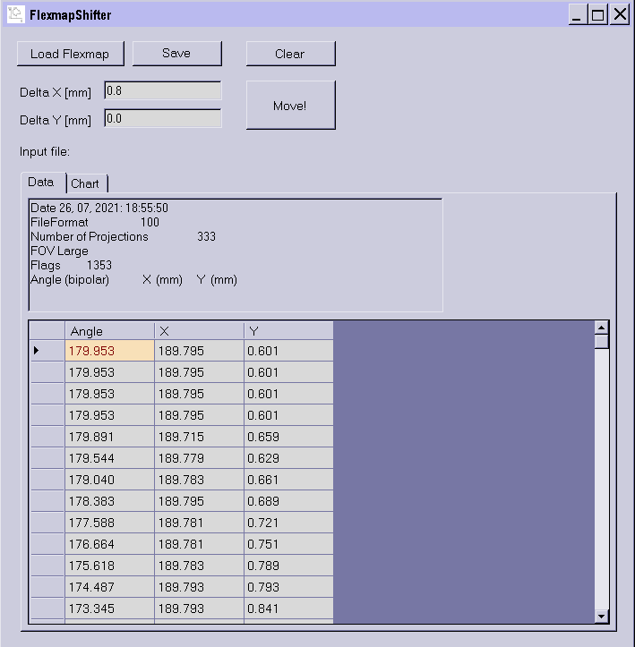

# FlexmapShifther
Simple .NETv4 app that can be used to preview Flexmap calibration files on Elekta XVI workstation. No installation is needed. It uses resources that are already present on XVI workstation.

## Installation

Copy FlexmapShifter.exe to your computer. If you wish to compile the project, all the files are included in the repository.

## How to use

First read: [PyQAserver](https://synergyqatips.readthedocs.io/en/latest/).

You can use the program for two things:

1. To simply view the flexmap files in graphical format. By doing so you can detect errors in calibration or unwanted detector movements.
2. To adjust X and Y columns of the calibration by adding a fixed offset. This is helpful when dealing with MFOV and LFOV deficiency. See PyQAserver docs.

When saving data the structure of the file should be preserved. Check this manually with a good editor, for example Notepad++ with all whitespace symbols on.

## Important note

If you are trying to modify flexmap columns, be sure you know what you are doing. Before using this program see the [licence](https://github.com/brjdenis/FlexmapShifter/blob/master/LICENSE) and make sure you understand it.

## Details

Made with Windows Forms for .NET Framework v 4.0.  

## LICENSE

Published under the MIT license. 