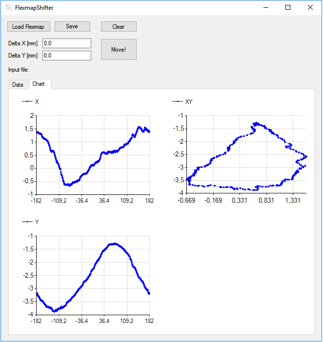

# FlexmapShifter
Simple .NETv4 app that can be used to preview Flexmap calibration files.




## Installation


Copy FlexmapShifter.exe from folder "Compiled" to your computer. If you wish to compile the project, all the files are included in the repository. To run the program a preinstall .NET Framework v4 is needed. Usually, workstations already have this installed.

## How to use

First read: [PyQAserver](https://synergyqatips.readthedocs.io/en/latest/).

You can use the program for two things:

1. To simply view the flexmap files in graphical format. By doing so you can detect errors in calibration or unwanted detector movements.
2. To adjust X and Y columns of the calibration by adding a fixed offset. This is helpful when dealing with MFOV and LFOV deficiency. See PyQAserver docs.

When saving data the structure of the file should be preserved. Check this manually with a good editor, for example Notepad++ with all whitespace symbols on.

## Important note

**Before using this program see the [licence](https://github.com/brjdenis/FlexmapShifter/blob/master/LICENSE) and make sure you understand it. The program comes with absolutely no guarantees of any kind.**

```
THE SOFTWARE IS PROVIDED "AS IS", WITHOUT WARRANTY OF ANY KIND, EXPRESS OR
IMPLIED, INCLUDING BUT NOT LIMITED TO THE WARRANTIES OF MERCHANTABILITY,
FITNESS FOR A PARTICULAR PURPOSE AND NONINFRINGEMENT. IN NO EVENT SHALL THE
AUTHORS OR COPYRIGHT HOLDERS BE LIABLE FOR ANY CLAIM, DAMAGES OR OTHER
LIABILITY, WHETHER IN AN ACTION OF CONTRACT, TORT OR OTHERWISE, ARISING FROM,
OUT OF OR IN CONNECTION WITH THE SOFTWARE OR THE USE OR OTHER DEALINGS IN THE
SOFTWARE.
```


## Details

Made with Windows Forms for .NET Framework v 4.0.  

## LICENSE

Published under the MIT license. 